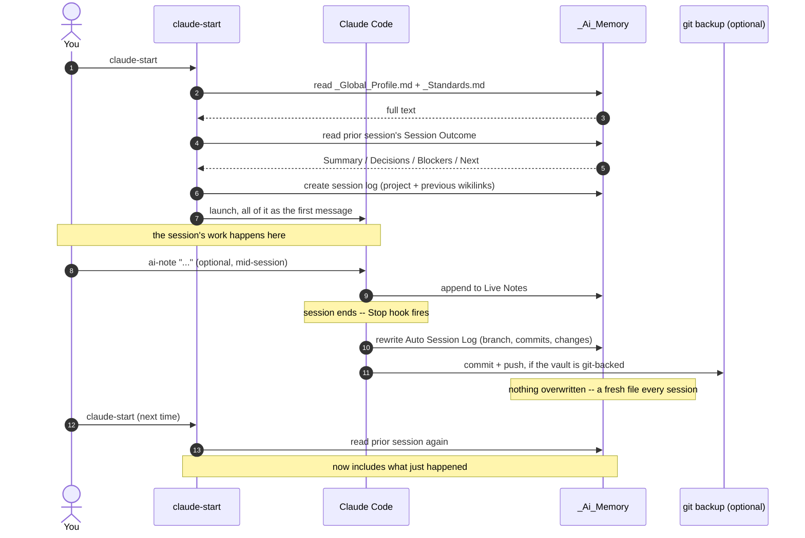
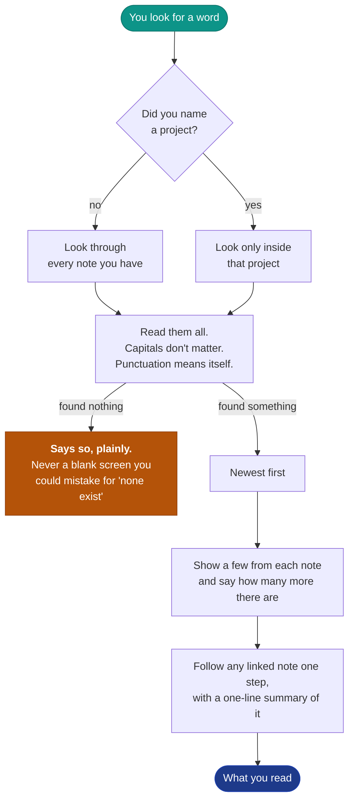
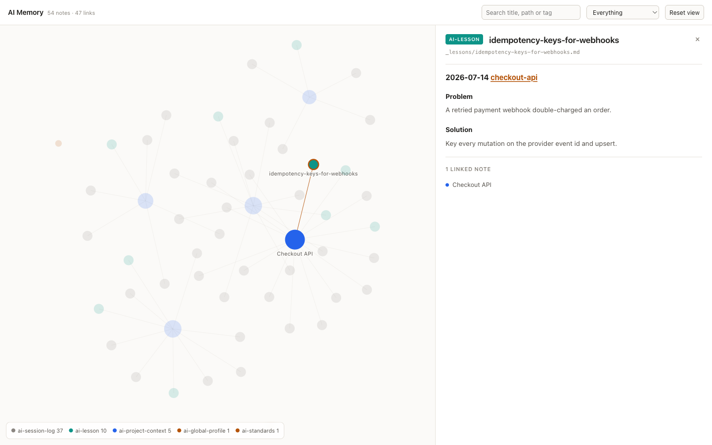

<div align="center">

# create-ai-memory

**The persistent memory layer for AI coding agents. One Markdown vault, every CLI.**

Your agent forgets everything the moment a session ends. create-ai-memory gives Claude
Code, Codex, Gemini, Cursor, and opencode a shared second brain: a plain-Markdown
vault that carries your profile, each project's context, and where you left off
into every new session, on its own.

No daemon. No database. No API key. Just zsh and Markdown you can read.

```sh
npm create ai-memory@latest
```

[](https://www.npmjs.com/package/create-ai-memory)
[](https://github.com/rambaarde/create-ai-memory/actions/workflows/ci.yml)
[](https://github.com/rambaarde/create-ai-memory/actions/workflows/publish.yml)


<br>


</div>

---

## The problem

Every AI coding session starts from zero. The moment a thread ends, the agent
forgets what was built, why each choice was made, and where you left off.

You pay it again on the next run: re-explaining the stack, re-litigating
settled decisions, losing "where I was". Switching agents makes it worse —
each CLI is its own island, so what Claude learned never reaches Codex.

## How it works

Keep the memory outside the chat, in plain Markdown on disk, and inject it
into whichever agent you launch. A thread is disposable; the vault is
permanent. Because it is just files, the same vault opens in
[Obsidian](https://obsidian.md) with graph view and backlinks — though
nothing here requires it.

Three layers, each injected at the right scope:

| Layer | Lives in | Injected | Holds |
|---|---|---|---|
| **Global** | `_Global_Profile.md`, `_Standards.md` | every session | who you are, your rules, commit policy |
| **Project** | `_projects/<repo>.md` | sessions in that repo | purpose, architecture, constraints, decisions |
| **Session** | `_session_logs/<repo>/<timestamp>.md` | next session as carryover | what changed, blockers, next steps |

The prior session's outcome is **inlined into the opening prompt**, not left
as a path the agent is told to go read. One environment variable,
`AI_MEM_ROOT`, points at the vault, so the whole system moves between
machines by pointing at the same folder.

## The full loop

Agents read the vault through `ai-mem.zsh` at launch and write to it through a Stop
hook at close. You read the same files in Obsidian, or through `ai-mem-search` and
`ai-mem-lint`. Neither side gets a privileged interface — it's the same folder either way.



Everything through step 10 touches only files on your machine. Step 11 is the
only network call in the whole loop, and only exists if you set up a git-backed
vault yourself; skip that and everything stays local, always.

## See a full session

```console
$ cd ~/code/checkout-api
$ claude-start
  Use terse output this session? [y/N] n

  # Claude launches pre-loaded with:
  #   • your profile + coding standards + commit policy   (global)
  #   • checkout-api: purpose, architecture, decisions    (project)
  #   • "Next: wire the refund webhook"                   (last session's carryover)

… you build the refund webhook, make a few commits …

$ ai-note "refund webhook live; still need idempotency keys"   # jot mid-session

# On exit, a hook stamps the session log with the branch, the commits you made,
# and anything uncommitted. Tomorrow's claude-start picks up exactly there.
```

No copy-pasting context. No re-explaining the stack. No "where were we."

## Quickstart

```sh
npm create ai-memory@latest     # copies the tool in and runs the setup, no git clone
exec zsh
```

Then, from inside any git repo:

```sh
claude-start                    # or codex-start / gemini-start / cursor-start / opencode-start
```

The agent opens already knowing your standards, this project, and where you left
off last time.

## Table of contents

<table>
<tr>
<td valign="top" width="33%">

**Overview**

- [The problem](#the-problem)
- [How it works](#how-it-works)
- [See a full session](#see-a-full-session)
- [What you get](#what-you-get)

**Getting started**

- [Quickstart](#quickstart)
- [Benchmarks](#benchmarks)
- [Install](#install)
- [Commands](#commands)
- [How search works](#how-search-works)
- [What it costs](#what-it-costs-and-what-it-cannot-do)

</td>
<td valign="top" width="33%">

**Reference**

- [Session skills](#session-skills-optional)
- [Your vault](#your-vault)
- [Open Knowledge Format](#open-knowledge-format)
- [Add another agent](#add-another-agent)
- [Integrations](#integrations)
- [Graph view](#graph-view)
- [GUI clients (MCP)](#gui-clients-mcp)
- [Configuration](#configuration)

</td>
<td valign="top" width="33%">

**Project**

- [Why not just CLAUDE.md?](#why-not-just-claudemd)
- [Troubleshooting](#troubleshooting)
- [Why plain files](#why-plain-files)
- [Tests](#tests)
- [FAQ](#faq)
- [Roadmap](#roadmap)
- [Contributing](#contributing)
- [License](#license)

</td>
</tr>
</table>

## What you get

| | |
|---|---|
| **Cross-agent memory** | One vault serves Claude Code, Codex, Gemini, Cursor, and opencode — and GUI clients like Claude Desktop through an MCP server. Context earned in one reaches the next. |
| **Automatic carryover** | A Stop hook writes the branch, the commits you made, and uncommitted changes into the session log, so tomorrow's run resumes where today's ended. |
| **Per-project context** | Each git repo gets its own note for purpose, architecture, and decisions, injected only for that project. |
| **Your rules, everywhere** | A global profile and standards note ride along in every session, on every project. |
| **Session skills you define** | Register your own y/n launch options (terse output, design review, minimal-code). create-ai-memory ships none; they are yours. |
| **Open agent model** | Adapters are three lines. Add opencode, aider, or anything with a CLI without touching the core. |
| **Obsidian-native** | The vault is plain Markdown, so it opens as an Obsidian second brain with graph view and backlinks, or as plain files with grep. |
| **Guardrails built in** | Every write is checked to stay inside the vault, and a commit hook refuses commits made without the vault context loaded. |
| **Zero runtime deps** | No daemon, no database, no API key, no server. It runs in your shell. |

## Benchmarks

Measured on a real 495-note vault (4.9 MB of Markdown), macOS, warm cache.
Every number below is reproducible with the command beside it.

**Tokens** — what the agent pays, every session

| | before | after | |
|---|---|---|---|
| Launch prompt | 7,207 | **4,321** | −40%, mirrored notes injected once ([why](#mirrored-notes-are-not-injected-twice)) |
| Search result, common term | 10,234 | **1,752** | −83%, bounded output ([why](#how-search-works)) |
| Lesson index, 96 lessons | — | **+829** | ~8 tokens per lesson, names only ([why](#lessons-are-indexed-not-injected)) |

```sh
# launch prompt
ai-context | wc -c            # chars; divide by ~4 for tokens
# search output, bounded vs not
ai-mem-search postgres | wc -c
AI_MEM_SEARCH_LIMIT=999999 ai-mem-search postgres | wc -c
```

**Speed**

| | |
|---|---|
| Search, common term, 501-note vault | **0.07 s** |
| Search at 2,000 / 10,000 notes | 1.3 s / 7.2 s — linear, see [limits](#what-it-costs-and-what-it-cannot-do) |
| Shell startup cost of the module | **< 0.01 s** |
| Recency sort, v0.11.0 regression fix | 25.4 s → **0.54 s** (47×) |

```sh
time ai-mem-search postgres >/dev/null
time zsh -c 'source shell/ai-mem.zsh'
```

The 47× is worth stating plainly because it was self-inflicted. The sort
spawned two subprocesses per matched line -- about 18,000 processes for one
query -- while the `grep` underneath it took 0.16 s. Benchmarking `grep`
alone said the command was fast; benchmarking the command said otherwise.
A regression guard now bounds it, with the bound set by measuring both
implementations rather than guessing.

**Footprint**

| | |
|---|---|
| Runtime dependencies | **0** |
| Package | **35 kB** (99.7 kB unpacked, 19 files) |
| Index, daemon, database, embeddings | **none** — a note is searchable the moment it is written |
| Tests | **153**, no network, no framework |

```sh
npm pack --dry-run && zsh tests/run.sh
```

## Install

Pick whichever fits how you manage your shell. All paths end at the same place.

**npm** (no git clone; the tool is bundled in the package):

```sh
npm create ai-memory@latest         # into ~/ai-memory, then runs the setup
npx create-ai-memory ~/code/ai-memory   # or a directory you choose
```

Package: [npmjs.com/package/create-ai-memory](https://www.npmjs.com/package/create-ai-memory)

**zsh plugin manager:**

```zsh
# zinit
zinit light rambaarde/create-ai-memory

# antidote (in your plugins file)
rambaarde/create-ai-memory

# oh-my-zsh: clone into custom/plugins, then add create-ai-memory to plugins=(...)
```

Plugin-manager installs only source the module. That is fine: the vault
auto-scaffolds from the shipped templates on first use, so `install.sh` is
optional. Set `AI_MEM_ROOT` in `~/.zshrc` first if you do not want the default
`~/.ai-memory/_Ai_Memory`.

> **zsh only.** The module uses `print -r`, `${(s:|:)}`, and associative arrays. A bash
> port is welcome as a PR; see [Roadmap](#roadmap).

## Commands

| Command | What it does |
|---|---|
| `claude-start` · `codex-start` · `gemini-start` · `cursor-start` · `opencode-start` | Launch an agent with full vault context and the session-skill picker |
| `ai-start [project]` | Prepare the session (project note and fresh log) without launching an agent |
| `ai-context [project]` | Print the vault context block for the current repo, and arm the git commit guard |
| `ai-note <text>` | Append a timestamped note to today's session log while you work |
| `ai-lesson <topic-slug> <problem> <solution>` | Append a dated Problem/Solution entry to a cross-project `_lessons/<topic-slug>.md` -- decisions, mistakes, solutions worth recalling outside the current project |
| `ai-mem-lint [--fix]` | Check the vault's links: orphaned session logs, dangling `previous` links, unreferenced project notes, and notes missing the `type:` field. `--fix` backfills `type:` into session logs written before the field existed |
| `ai-mem-search <term> [project]` | Case-insensitive literal search across the vault (or one project's logs), newest match first. Paths print relative to a root stated once in the header. Output is capped (`AI_MEM_SEARCH_LIMIT`, default 25) with an explicit `N hidden` notice, because the usual caller is an agent with a finite context window. Also resolves any `[[wikilink]]` on a matched line to its project note -- one hop out along the graph, always on, not a flag to remember |
| `ai-mem-serve [port] [--no-open]` | Open the vault as a browsable graph on `127.0.0.1`. Agents run this for you when you ask to see your memory (see [Graph view](#graph-view)) |
| `ai-mem-vault-backup` | Commit and push the vault if it's git-backed. `ai-note`/`ai-lesson` already call this; use it directly after editing a session log or project note by hand |

Project is auto-resolved from the current git repo; pass a name to override.

## How search works

Reads your notes directly, every time. No index, no daemon, no embeddings —
nothing to rebuild and nothing that can go stale. A note is findable the
second you write it.



The shaded boxes are the two that matter: an empty result that **says** it is
empty, and an output short enough to read to the end.

```console
$ ai-mem-search prisma
240 match(es) for 'prisma'
paths below /Users/you/_Ai_Memory
--
_session_logs/checkout-api/checkout-api-2026-08-31_00-00-00.md:56:  - **A green deploy log is not evidence a migration ran.** Verify against `_prisma_migrations`.
...
--
showing 25 of 240 (215 hidden), across 25 file(s), at most 1 line(s) each -- for more lines per file raise AI_MEM_SEARCH_PER_FILE, or narrow with: ai-mem-search 'prisma' <project>
```

Under the hood it is one `grep -rniF`, a sort, and a cap. Each choice exists
because the alternative gave a wrong answer on a real vault:

| choice | why |
|---|---|
| **Case-insensitive** | A false empty is the worst answer a memory tool can give. `precompact` found 0 case-sensitively and 3 with `-i`; `Postgres` 56 vs 90. |
| **Literal, not regex** | The caller is usually an agent passing free text, where a stray `.` or `(` must match itself. |
| **Lessons first, then newest** | Session logs outnumber lessons ~4:1 and are always newer, so recency alone buried them — searching `snapshot` returned 25 logs and none of the 3 lessons answering it. A lesson now outranks newer chatter. |
| **Bounded output** | Unbounded, a common term ran ~29k tokens and was silently truncated by the host — leaving the agent unable to tell *hidden* from *absent*. |
| **One line per file** | Until the budget binds. Spends it on distinct notes rather than the chattiest one. |
| **Compact lines** | Vault root printed once and stripped from every path; lines over 200 chars clamped. |
| **One hop out** | Any `[[wikilink]]` on a hit resolves to its project note with a one-line excerpt, so a lesson tells you where it happened without a second search. |

### What it costs, and what it cannot do

Measured, not estimated. Reproduce with `ai-mem-search <term>`.

**Matching is substring, case-insensitive, literal** — not word matching, not
stemming, not fuzzy:

| query | matches | |
|---|---|---|
| `git` | 765 | substring — also hits `github` |
| `github` | 255 | a subset of the above |
| `Postgres` / `POSTGRES` / `postgre` | 93 each | case ignored, prefix matches |
| `.env` | 131 | the dot is literal |
| `env` | 307 | more — `.env` is narrower |
| `postgress` *(typo)* | **0** | **no fuzzy matching** |

That last row is the limit: a misspelling finds nothing.

**Search one distinctive word, not a sentence.** Matching is literal
substring, so the whole error line `command not found: sed` finds **nothing**
while `command not found` finds it — and a bare tool name like `sed` returns
1,012 irrelevant lines. Pick the most unusual word in the symptom and try two
or three separately.

**Token cost is bounded and flat:**

| matches | tokens |
|---|---|
| 0 | ~23 |
| 240 | ~1,224 |
| 10,198 | ~1,270 |

Forty times the matches for the same cost.

**Speed is linear in vault size**, dominated by how many lines match:

| vault | rare term | common term |
|---|---|---|
| 501 notes *(real)* | — | **0.07 s** |
| 2,000 *(synthetic)* | 0.35 s | 1.29 s |
| 10,000 | 1.74 s | 7.20 s |

Comfortable to a few thousand notes — years of daily logs. Past ~10k, scope
it: `ai-mem-search <term> <project>`. If that is not enough, this is the wrong
tool and you want a real index.

### Is it used while you code, or only at launch?

**Pushed once at launch** (~4,300 tokens): your profile, standards, the
project note's path, a digest of the last session, and the lesson topics.

**Pulled on demand after that.** Nothing re-injects. The agent reaches the
vault mid-session only by running `ai-mem-search` itself — which the launch
prompt tells it to do before solving anything, and again whenever it hits a
blocker.

So: a reference library the agent is told to consult, not a memory it thinks
with. Two consequences — launch a bare `claude` instead of `claude-start` and
you get **no vault context at all**, and whether it helps mid-build depends on
the agent actually searching.

### Mirrored notes are not injected twice

`_Standards.md` ships declaring `mirror_of: _Global_Profile.md`. The launch
prompt reads both, so injecting both in full restates text the model just
read.

When a note declares `mirror_of:`, only the differing lines are injected,
under a marker naming what was elided. On a real vault, 72 of the mirror's 80
unique lines were verbatim duplicates: **launch prompt 7,200 → 4,300 tokens,
nothing lost.**

Matching is exact and line-by-line, so anything reworded survives. It fails
**open** — no frontmatter, a missing source, or an empty diff all inject the
note in full. Injecting twice costs tokens; dropping a note costs the agent
context it was promised.

### Lessons are indexed, not injected

`_lessons/` entries are the only notes true across projects, and the hardest
to find — searching for one means guessing a term for knowledge you don't
know you have. So the launch prompt lists **every lesson slug and no bodies**:

```text
- Lessons already recorded (96), listed by topic slug only. If one looks
  relevant, read it with `ai-mem-search <slug>` before solving again.
  prisma-connection-pool-exhaustion, decimal-money-precision-js, ...
```

A slug is the lesson compressed: `prisma-connection-pool-exhaustion` tells
you whether to open it without opening it. ~8 tokens each; 96 lessons cost
~830.

Newest first, capped at `AI_MEM_LESSON_INDEX_LIMIT` (200). The cap matters —
past a few hundred, most titles are irrelevant to any given session, and a
long tail of near-misses is the most damaging kind of distractor for a model.

Returns non-zero on no matches, a missing term, or an unknown project, so
it composes in a script.

## Session skills (optional)

You define your own per-session skills; create-ai-memory ships none. At launch it asks
y/n for each skill you registered, then injects the chosen instruction blocks into
the agent (and for Cursor, writes them as a managed always-apply rule). Register
nothing and every session is plain.

Add skills in `~/.zshrc` before sourcing the module. Each entry maps a `key` to
`prompt::instruction block`, and `AI_MEM_SKILL_ORDER` sets the ask order:

```zsh
typeset -gA AI_MEM_SKILLS
AI_MEM_SKILLS[terse]='Use terse output this session?::Respond tersely; drop filler and hedging.'
AI_MEM_SKILLS[design]='Use strict UI design discipline?::Apply careful frontend/UI design review to any design work.'
AI_MEM_SKILL_ORDER=(terse design)

source "$HOME/ai-memory/shell/ai-mem.zsh"
```

The injected block applies for the whole run, so a session's chosen skills persist
as instructions across every change the agent makes.

### Recommended skills to wire in

These are the session skills worth having on the picker. Each maps to a working
Claude Code skill; if you have the skill installed, the block below tells the agent
to use it, and the behavior still applies to agents that do not have the skill
because the instruction is inlined. Drop them into `AI_MEM_SKILLS` and reorder to
taste.

```zsh
typeset -gA AI_MEM_SKILLS

# caveman: terse, no-filler output
AI_MEM_SKILLS[caveman]='Terse output (caveman) this session?::Respond terse like a smart caveman. Keep technical substance exact; drop filler, pleasantries, and hedging.'

# ponytail: the laziest solution that actually works (stdlib > deps, one line > fifty)
AI_MEM_SKILLS[ponytail]='Minimal-code (ponytail) this session?::Use the ponytail approach. Prefer the standard library before new code, native platform features before dependencies, and one line before fifty. Question whether the task needs to exist at all (YAGNI).'

# hallmark: anti-AI-slop UI and frontend design
AI_MEM_SKILLS[hallmark]='Strict UI design (hallmark) this session?::Use the hallmark approach for any frontend, UI, or design work. Avoid generic AI-slop layouts; make type, spacing, color, and hierarchy intentional.'

AI_MEM_SKILL_ORDER=(caveman ponytail hallmark)

source "$HOME/ai-memory/shell/ai-mem.zsh"
```

| Skill | What it does | Reach for it when | Source |
|---|---|---|---|
| **caveman** | Strips output to terse, no-filler answers | You want signal over prose | [caveman.so](https://caveman.so/) |
| **ponytail** | Pushes the smallest change that works; stdlib and native features over dependencies | Building features or reviewing for over-engineering | [DietrichGebert/ponytail](https://github.com/DietrichGebert/ponytail) |
| **hallmark** | Anti-AI-slop design discipline for UI and frontend work | Any visual or frontend task | [usehallmark.com](https://www.usehallmark.com/) |

Skills are per session and independent, so you can turn on `ponytail` for a
refactor and add `hallmark` only when you touch the UI. These are separate,
installable Claude Code skills; the blocks above inline their behavior so a
session still benefits even on an agent that does not have the skill installed.

If you want a queryable knowledge graph of your codebase alongside your memory,
pair create-ai-memory with [graphify](https://github.com/safishamsi/graphify).

## Your vault

The vault is a folder of Markdown. Point `AI_MEM_ROOT` at a new directory or at an
existing Obsidian vault; either way you get graph view, backlinks, and full-text
search over your own AI memory, plus plain `grep` when you want it.

```
$AI_MEM_ROOT/
  _Global_Profile.md          your cross-project rules      (injected every session)
  _Standards.md               extra shared standards        (injected every session)
  _projects/
    _project_template.md       scaffold for new project notes
    <repo>.md                  per-project durable context
  _session_logs/
    _session_template.md       scaffold for new session logs
    <repo>/
      <repo>-<timestamp>.md    one file per session
  _lessons/
    _lesson_template.md       scaffold for new lesson topics
    <topic-slug>.md            cross-project decisions/mistakes, filed by ai-lesson
```

Notes are created from templates on first use and never overwritten. Edit
`_Global_Profile.md` and `_Standards.md` to make them yours; the shipped versions
are sanitized placeholders.

## Open Knowledge Format

[OKF](https://github.com/GoogleCloudPlatform/open-knowledge-format) is
Google's vendor-neutral spec for portable, agent-readable knowledge. A bundle
is just a directory tree of markdown files — shippable as a repo, tarball or
zip, readable by any agent, Obsidian, MkDocs or graph viewer without a
translation layer.

Your vault is one, by convergence rather than adoption. The
[spec](https://github.com/GoogleCloudPlatform/knowledge-catalog/blob/main/okf/SPEC.md)
requires no file at the bundle root and exactly one frontmatter key:
*"`type` is the only always-required key."*

| OKF | Here |
|---|---|
| Markdown in a directory hierarchy | ✅ |
| YAML frontmatter | ✅ every note |
| **`type` — the only required key** | ✅ `ai-project-context`, `ai-lesson`, `ai-session-log`, … |
| Recommended `title` / `description` / `tags` | ⚠️ partial |
| Cross-links as markdown links | ⚠️ `[[wikilink]]` instead |
| `index.md` / `log.md` | optional in the spec; not generated |
| No SDK, no account, git-versionable | ✅ |

One real deviation: **links stay Obsidian-style**, because the graph view and
backlinks are much of why anyone keeps a vault. No `index.md` is generated —
`grep` never reads one and a materialized index goes stale on rename.

Session logs predate the `type` field, so a vault in use holds notes without
it:

```console
$ ai-mem-lint --fix
backfilled `type: ai-session-log` into 350 session log(s)
```

Edits in place, preserves frontmatter and body, idempotent.

## Add another agent

Launchers are not hardcoded. Each agent is one small adapter, and the
`<name>-start` function is generated for you. `claude`, `codex`, `gemini`,
`cursor`, and `opencode` ship built in. To add `aider`:

1. Define the adapter in `shell/adapters.zsh`. It receives `$1` memory prompt,
   `$2` mode block, and `$3` onward extra args:
   ```zsh
   __ai_adapter_aider() {
       local memory_prompt="$1"
       aider --message "$memory_prompt"
   }
   ```
2. Register it in `~/.zshrc` before sourcing, or edit the default:
   ```zsh
   export AI_MEM_AGENTS="claude codex gemini cursor opencode aider"
   ```
3. `aider-start` now exists. No core edits.

`cursor-start` targets `cursor-agent`, Cursor's CLI, which takes the prompt
positionally. If only the `cursor` GUI is installed it falls back to opening
that instead -- the GUI has no prompt path, so the session's skills still
arrive via the managed rule file but the vault context does not.

Name private helpers with **two** leading underscores (`__ai_adapter_aider`,
not `_ai_adapter_aider`). Claude Code replays a snapshot of your interactive
shell for every command it runs, and that snapshot drops single-underscore
function names -- the filter targets zsh's completion functions, but it takes
private helpers with it. A one-underscore helper simply will not exist inside
an agent-run command.

## Integrations

### Graph view

`ai-mem-search` answers a question you already knew to ask. This answers the
other one — what is in there, and what turned out to be connected.

Ask the agent ("open my memory") or run it:

```sh
ai-mem-serve          # opens a browser at http://127.0.0.1:7777
```



Nodes are coloured by `type` and sized by how many notes link to them.
Selecting one dims everything unconnected and renders the note beside the
graph. *Durable knowledge* is the default view — session logs usually
outnumber everything else and bury the rest.

Loopback only, deliberately: the vault holds project history. Zero
dependencies — the layout is a small force simulation, not a charting
library, so it works offline. Run it twice and the second call just opens the
tab, unless another vault holds the port.

### GUI clients (MCP)

The launchers reach an agent through its opening prompt. **A GUI opened from
the Dock never runs one**, so Claude Desktop and the Cursor GUI would see
nothing. `ai-mem-mcp` is their channel.

**Claude Desktop** — `~/Library/Application Support/Claude/claude_desktop_config.json`
(**Cursor** — `~/.cursor/mcp.json`, same shape):

```json
{
  "mcpServers": {
    "ai-memory": {
      "command": "ai-mem-mcp",
      "env": { "AI_MEM_ROOT": "/absolute/path/to/your/_Ai_Memory" }
    }
  }
}
```

Six tools, read **and** write, so a GUI session is not a dead end:
`search_memory`, `get_context`, `read_note`, `add_note`, `add_lesson`,
`open_graph`. Each shells out to the same zsh functions the CLI uses — one
implementation, not a copy that drifts. A note written from Claude Desktop is
committed and pushed exactly like one written in a terminal.

MCP's `instructions` field carries a standing brief (read context first,
search before solving, write back after) — without it a model has no reason
to suspect a memory exists. Tool descriptions stay terse because schemas are
re-sent every turn: six tools cost ~429 tokens/turn, the brief ~290 once.

**Do not register this for a terminal agent.** Claude Code, Codex, Gemini and
opencode have a shell and should call `ai-mem-search` directly.

### Claude Code hooks
The files live in `hooks/claude/`. Record repo `HEAD` at session start, then on
exit write an auto block to the log with the branch, commits made this session, and
uncommitted changes, so the next session has real carryover instead of an empty
template. A third hook fires right before Claude Code auto-compacts: the first
attempt each session it blocks compaction once and tells the agent to run
`ai-note` before its working context gets thrown away, then gets out of the
way for every later attempt (one-shot, via a marker file next to the log) so
the session can never get stuck refusing to compact. It only guards
auto-compact, not a deliberate `/compact`. Merge `settings.snippet.json` into
`~/.claude/settings.json`, replacing `<AI_MEM_HOME>` with an absolute path.
All three hooks no-op for plain `claude` runs; they gate on
`$AI_MEM_ACTIVE_SESSION_LOG`. This is Claude-Code-specific -- other agents
(Codex, Gemini, etc.) have no equivalent pre-compaction hook, so jotting
things down with `ai-note`/`codex-note` as you go still matters there.

### Git commit guard
The files live in `hooks/git/`:

- **`commit-msg`** requires Conventional Commits and a structured body, and that
  `ai-context` was loaded in the committing shell, matching a per-repo token. An
  agent cannot commit without the vault context loaded.
- **`pre-push`** blocks direct pushes to `main` unless `ALLOW_PUSH_TO_MAIN=1`.

Enable per repo:

```sh
cp ~/ai-memory/hooks/git/* <repo>/.githooks/
git -C <repo> config core.hooksPath .githooks
```

## Configuration

| Env var | Default | Purpose |
|---|---|---|
| `AI_MEM_ROOT` | `$HOME/.ai-memory/_Ai_Memory` | Vault root. Point at any folder, including an existing Obsidian vault |
| `AI_MEM_AGENTS` | `claude codex gemini cursor opencode` | Space-separated agents to generate `-start` functions for |
| `AI_MEM_SKILLS` / `AI_MEM_SKILL_ORDER` | empty | Your per-session skills (see above) |
| `AI_MEM_LESSON_INDEX_LIMIT` | `200` | Lesson slugs listed in the launch prompt before it truncates to the newest. Names only -- bodies are never injected |
| `AI_MEM_SEARCH_LIMIT` | `25` | Result lines `ai-mem-search` prints before it truncates. The default is sized for an agent's context window; raise it when you are reading the output yourself (see [How search works](#how-search-works)) |
| `AI_MEM_SEARCH_PER_FILE` | `1` | Lines shown per file once the cap binds. Spreads results across notes instead of on the chattiest one; ignored when every match already fits |

## Why not just CLAUDE.md?

You probably already have one. Keep it — this does a different job, and the
tool defers to it by design.

| | `CLAUDE.md` / `AGENTS.md` | create-ai-memory |
|---|---|---|
| Holds | rules and conventions | what happened, decided, and broke |
| Changes | when you edit it | every session, automatically |
| Scope | that one repo | global + per-repo + cross-project lessons |
| Agents | one vendor's file per agent | one vault, five CLIs |
| Answers | *"how should you work here?"* | *"what did we already try?"* |

A `CLAUDE.md` is a standing instruction. It does not know that last Tuesday
you found the connection pool was sized below the worker count, or that the
same bug bit a different repo in March. That is what accumulates here.

They compose: the injected profile explicitly tells the agent that repo-local
instruction files **override it** for that repo. Nothing to migrate, nothing
to delete.

## Troubleshooting

**`claude-start` works but the agent has no memory of anything.**
You launched plain `claude`. Nothing hooks it — the vault reaches the agent
through the launcher's opening prompt, so a bare CLI gets none of it.

**A command "isn't installed" right after an upgrade.**
Your shell is stale. These are zsh functions loaded when the terminal opened;
editing or upgrading the module changes nothing in a shell already running.
Open a new terminal, or `exec zsh`. `which` under bash will not find them
either — use `command -v`.

**The agent's "Project context" is bracket placeholders.**
The project note was never filled in. The launch prompt now says so and asks
the agent to fill it from the repo; you can also edit
`_projects/<repo>.md` yourself. It is read at every launch for that repo, so
it is worth ten minutes once.

**`ai-mem-lint` reports orphaned session logs.**
Their `project:` frontmatter is not a `[[wikilink]]`, usually because the
vault's session template predates the current one. Scaffolding only fills in
*missing* files, so an existing vault keeps its old templates. Run
`ai-mem-lint --fix`.

**Search returns nothing for a term you are sure you wrote.**
Matching is literal substring with no fuzzy matching, so a typo finds zero.
Search one distinctive word rather than a phrase or a whole error line — see
[what it costs](#what-it-costs-and-what-it-cannot-do).

## Why plain files

create-ai-memory is deliberately small. There is no server to run, no container to pull,
no database to migrate, no API key to store. The design choices behind that:

- **The vault is the source of truth; the chat is disposable.** Durable state
  lives in Markdown you can read, diff, and version, not inside any agent.
- **Files over a service.** A folder syncs over git, Dropbox, or Syncthing, opens
  in Obsidian, and greps in a shell. It outlives any one tool.
- **Explicit over magic.** You decide what goes in the profile, the project note,
  and the session log. The agent reads them; it does not silently rewrite your
  memory behind your back.
- **Path-guarded writes.** Every file operation is checked to stay inside
  `$AI_MEM_ROOT`, so an agent cannot write outside the memory boundary.
- **Project equals git repo.** Resolution prefers the repo you are standing in, so
  moving between projects in one shell never pins the wrong project.

If you want an auto-capturing server with a web UI and vector search, other tools
do that. create-ai-memory trades those for something you can read end to end in an
afternoon and carry anywhere.

## Tests

Offline unit suite (throwaway vault and git repo, no network): path guarding,
project resolution, session prep, the context prompt, the skill picker, launcher
generation, adapter dispatch, the commit token, `ai-note`, and the cursor rule
file.

```sh
zsh tests/run.sh     # offline unit tests (38 assertions)
zsh tests/smoke.sh   # live: launches each agent headlessly, checks it responds
```

`smoke.sh` makes real API calls, so each CLI must be installed and authed
(opencode defaults to DeepSeek; set it up or pass
`AIMEM_SMOKE_OPENCODE_MODEL=provider/model`).

## FAQ

**Does it send my code anywhere?**
No. create-ai-memory is shell functions plus Markdown files on your disk. The only network
calls are the ones your agent already makes.

**Do I need Obsidian?**
No. The vault is plain Markdown. Obsidian is a nice way to browse it, not a
requirement.

**Do I need an API key or a paid plan?**
No. create-ai-memory itself needs neither. Your agents use whatever auth they already have.

**Which shells and platforms?**
zsh today, on macOS and Linux (including WSL). A bash port is on the roadmap.

**Does plain `claude` still work?**
Yes. Only the `*-start` launchers inject memory; plain runs are untouched, and the
hooks no-op unless a session was launched through create-ai-memory.

**Can I use my existing Obsidian vault?**
Yes. Point `AI_MEM_ROOT` at it. Notes are additive and never overwrite your files.

**How is a "project" identified?**
By the directory name of the git repo you are in.

**My agent isn't listed. Can I add it?**
Yes, if it has a CLI. See [Add another agent](#add-another-agent); it is three
lines.

## Roadmap

- Bash port of the shell module.
- More agent adapters shipped by default: aider and others.
- Optional cross-project index and search over session logs.

## Contributing

Clone the repo and run `install.sh` from the checkout — that's the source of
truth every other install path (npm, plugin managers) reuses:

```sh
git clone https://github.com/rambaarde/create-ai-memory.git ~/ai-memory
~/ai-memory/install.sh
```

Issues and PRs are welcome. Good first areas: a bash port, new agent adapters, and
docs. Run `zsh tests/run.sh` before opening a PR; keep changes additive and the
vault path-guarded.

Persistent AI memory should not be a personal hack; it should be something the
whole community can install.

## License

MIT © Ram Christopher Baarde
